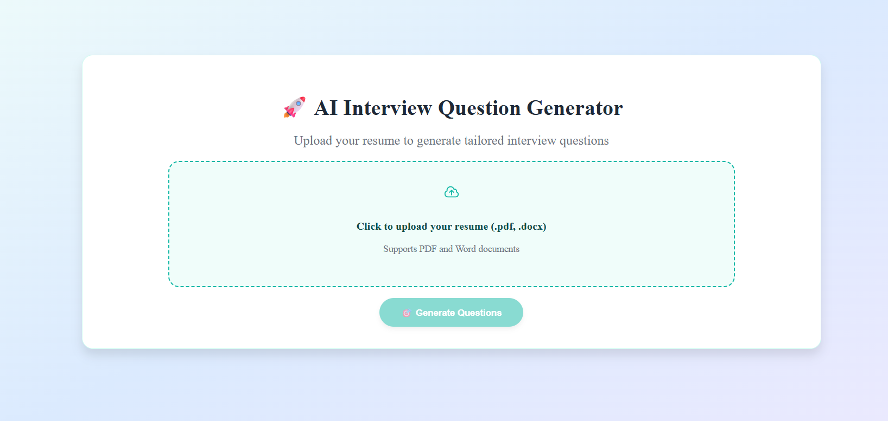
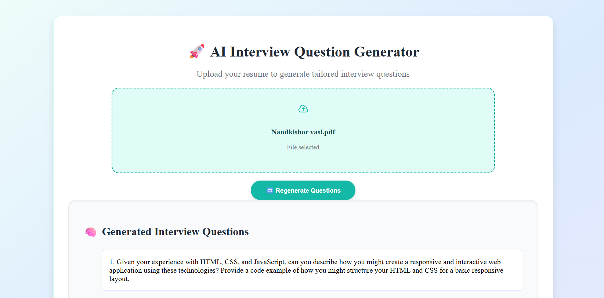
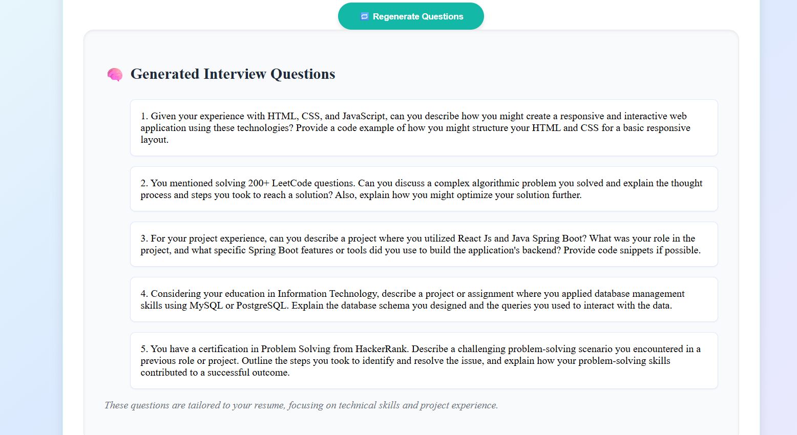

# AI Resume Interview Question Generator

This project uses AI to generate personalized technical interview questions based on a candidate’s resume. Simply upload your `.pdf` or `.docx` resume, and receive 5 tailored questions evaluating your skills, education, and project experience.

---
DEMO UI
## 🌐 Live Demo

👉 [https://ai-interview-question-generator-gamma.vercel.app/](https://ai-interview-question-generator-gamma.vercel.app/)

## ✨ Features

- Upload `.pdf` or `.docx` resumes
- AI-generated interview questions based on resume content
- Clean and intuitive React interface
- Integrates with Cohere’s `command-r-plus` model via LangChain

---

## 🧩 Tech Stack

| Frontend               | Backend                     | AI/ML                |
|------------------------|-----------------------------|----------------------|
| React, Axios, Heroicons | Python, FastAPI            | Cohere via LangChain |

